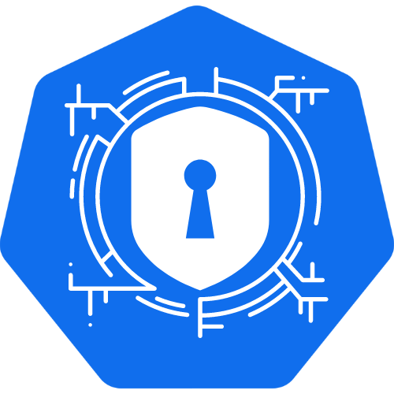

---

layout: col-sidebar
title: OWASP Kubernetes Scanner
tags: kubernetes security
level: 2
type: 
pitch: Kubernetes Security and Compliance Scanner.

---

### Kubernetes Security Scanner
It scans K8s cluster for misconfiguration, runtime issues, and compliance (NSA/CISA, CIS, PCI, SOC2) 
violations. It also checks for node postures and hardening. It has default scan rules and
we can write custom rules. We can get the reports on Slack and Elasticsearch.

It is built around a NoSQL-style query engine, hence it is very lightweight, and the core engine is written in pure
python. 

